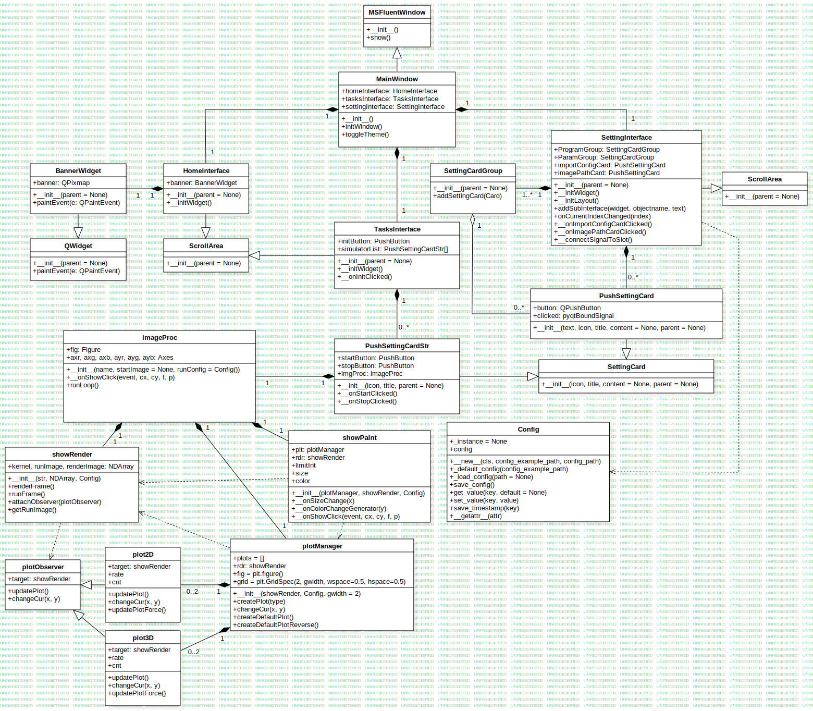

<font face="Cascadia Code" >

# iGEM Diffusion Simulator

## 使用方法

首先你要有 3.10 及以上版本的 python

```shell
pip install -r requirements.txt
python main.py
```

## 功能分析与建模

### 数学原理

#### 热扩散方程
$$
\frac{dc}{dt} = \alpha \frac{d^2c}{dx^2}
$$

#### 一维的离散形式
$$
c_{x,t+1} - c_{x,t} = \frac{\alpha}{2}((c_{x+1,t} - c_{x,t}) - (c_{x,t} - c_{x-1,t}))
$$

$$
c_{x,t+1} - c_{x,t} = \frac{\alpha}{2}(c_{x+1,t} - 2c_{x,t} + c_{x-1,t})
$$

$$
c_{x,t+1} = \frac{\alpha}{2} c_{x+1,t} + (1 - \alpha) c_{x,t} + \frac{\alpha}{2} c_{x-1,t}
$$

$$
K_\alpha = \begin{bmatrix}
\frac{\alpha}{2} & 1-\alpha & \frac{\alpha}{2}
\end{bmatrix}
$$

#### 二维的离散形式
$$
G(x) = \frac{1}{\sqrt{2\pi}\sigma}e^{-\frac{x^2+y^2}{2\sigma^2}}
$$

$$
K_\alpha = \begin{bmatrix}
w_2 & w_1 & w_2\\
w_1 & 1 - \alpha & w_1\\
w_2 & w_1 & w_2\\
\end{bmatrix}
$$

$$
e_1 = e^{-1}, e_2 = e^{-2}
$$

$$
w_1 = \frac{\alpha}{4} \frac{e_1}{e_1 + e_2}, w_2 = \frac{\alpha}{4} \frac{e_2}{e_1 + e_2}
$$

#### 介质在每帧小于一单元格的位移量化
$$
V_x = \begin{bmatrix}
1 + v_x & 1 & 1 - v_x\\
\end{bmatrix}
$$

$$
V_y = \begin{bmatrix}
1 + v_y \\ 1 \\ 1 - v_y\\
\end{bmatrix}
$$

#### 总公式
$$
K_{t} = \begin{bmatrix}
w_2 (1 + v_x) (1 + v_y) & w_1 (1 + v_y) & w_2 (1 - v_x) (1 + v_y)\\
w_1 (1 + v_x)           & 1 - \alpha    & w_1 (1 - v_x)          \\
w_2 (1 + v_x) (1 - v_y) & w_1 (1 - v_y) & w_2 (1 - v_x) (1 - v_y)\\
\end{bmatrix}
$$

$$
C_{t+1} = C_{t} * K_{t}
$$

#### 以对数的方式呈现一个更符合人眼的效果

$$
p(0) = 0, p(1) = 1
$$

$$
p(x) = \ln((e - 1)x + 1)
$$

### 需求建模

#### [需求描述]

1. 通过 UI 进行交互控制

2. 实现对扩散的即时模拟功能

    2.1 按照数学公式实现一个二维扩散系统

    2.2 通过颜色回显展示平面的粗略情况

    2.3 实时显示回显中特定位置的梯度图像

    2.4 通过画笔即时编辑系统

    2.5 自定义物质之间的反应关系

3. 提供高自由度的配置方案

    3.1 实现简单的配置文件修改

    3.2 提供更精细的参数调节控件

4. 通过适当的方法将模拟的结果导出

    4.1 截取扩散过程的某一瞬间导出

    4.2 将对应位置的图表导出

#### [抽象拆分]

1. [主界面类] MainWindow

    继承自 MSFluentWindow

    方法：构建图形化界面

    属性：导航栏、各种子页面

2. [子页面类] HomeInterface TasksInterface SettingInterface

    继承自 ScrollArea

    方法：界面初始化、添加选项卡

    属性：控制按钮选项卡、调参控件

3. [按钮选项卡类] PushSettingCard PushSettingCardStr

    继承自 SettingCard

    方法：按钮事件处理

    属性：按钮、按钮状态

4. [图片横幅类] BannerWidget

    继承自 QWidget

    方法：横幅绘制

    属性：图片

5. [扩散模拟内核类] imageProc

    方法：运行单帧、渲染结果、运行循环

    属性：模拟场地矩阵、扩散参数配置、颜色回显

6. [配置列表类] Config

    方法：加载配置、保存配置、设置配置

    属性：配置文件

7. [矩阵类] array

    方法：矩阵基本运算、扩散运算

    属性：矩阵的值

8. [颜色回显类] showRender

    方法：鼠标事件处理

    属性：渲染矩阵、图表、画笔

9. [图表类] plotManager

    方法：渲染图表、导出图表

    属性：坐标轴、散点数据

10. [画笔类] showPaint

    方法：在指定矩阵上绘制

    属性：控制按钮、画笔参数配置

### [类图]



### [时序图]


### 设计模式

#### 观察者模式

图表类 plot2D plot3D 继承自 plotObserver

```python
class plot2D(plotObserver):
class plot3D(plotObserver):
```

它们被实例化时，会插入到 showRender 的 observers 列表中

```python
class showRender:
    observers = []
    def attachObserver(self, observer: plotObserver):
        self.observers.append(observer)

class plot2D(plotObserver):
    def __init__(self, rdr: showRender, fig, grid, gidx, rate):
        # ...
        rdr.attachObserver(self)
```

当 showRender 产生一次更新时，会触发列表中所有类的 updatePlot() 方法

```python
class showRender:
    def renderFrame(self):
        # ...
        for observer in self.observers:
            observer.updatePlot()
```

#### 工厂模式 & 建造者模式

图表工厂类 plotManager 提供图表界面的创建、排版与布局
它通过 createPlot() 方法的参数，来决定工厂生产 plot2D 还是 plot3D
同时也提供两种默认的排布，即 2D | 3D 和 3D | 2D，以建造出整个图表界面

```python
class plotManager:
    def createPlot(self, type):
        if self.gidx >= self.gwidth:
            return None
        if type == 0:
            plot = plot2D(self.rdr, self.fig, self.grid, self.gidx, self.p2drate)
        else:
            plot = plot3D(self.rdr, self.fig, self.grid, self.gidx, self.p3drate)
        self.gidx += 1
        self.plots.append(plot)
        return plot

    def createDefaultPlot(self):
        self.createPlot(0)
        self.createPlot(1)

    def createDefaultPlotReverse(self):
        self.createPlot(1)
        self.createPlot(0)
```

### 函数闭包

#### 批量生成按钮事件函数

配置界面的按钮事件函数，重复度极高，可以利用函数闭包批量生成

先批量生成类型转换函数

```python
    def __convertGenerator(self, type):
        def __convert(value):
            if type == "bool":
                return value == "True"
            elif type == "int":
                return int(value)
            elif type == "float":
                return float(value)
            else:
                return value
        return __convert
```

再根据类型批量生成按钮事件函数

```python
    def __onCardClickedGenerator(self, card: PushSettingCard, configname: str, type: str = "float"):
        # ...
        ledit.setText(str(config.get_value(configname)))
        def __onCardClicked():
            if ledit.text():
                config.set_value(configname, self.__convertGenerator(type)(ledit.text()))
                ledit.setText(str(config.get_value(configname)))
        return __onCardClicked
```
